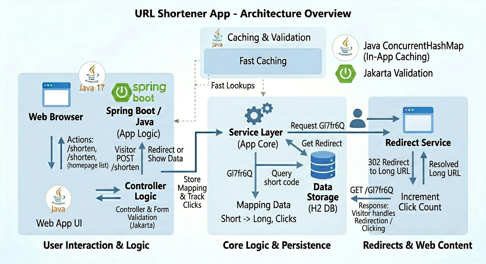

# URL Shortener(URL短縮サービス)

**言語:** [English](README.md) | [日本語](README.jp.md)

---

シンプルなWeb画面を持つURL短縮サービスです。Spring Boot + Thymeleafで作成しました。
長いURLを貼り付けると短いリンクが生成され、クリック数も記録されます。

## 概要

実際にブラウザで操作できる、フルスタックのJavaアプリです(APIだけではありません)。
これまでフロントエンドやAWS関連のプロジェクトが多かったので、
「ジュニアJavaエンジニア」レベルのプロジェクトとして作成しました。

## 仕組み

1. ホームページのフォームに長いURLを貼り付ける
2. ランダムな7文字のコード(例: `Gl7fr6Q`)が生成され、データベースに保存される
3. `/Gl7fr6Q` にアクセスすると元のURLにリダイレクトされ、クリック数が増加する
4. ホームページには最近作成したリンクの履歴とクリック数が表示される

## 使用技術

- Java 17
- Spring Boot 3.2(Web + Thymeleaf + JPA)
- H2(インメモリデータベース — 別途データベースサーバー不要)
- Jakarta Validationによるフォーム検証

## 画面


## 実行方法

```bash
mvn spring-boot:run
```

その後、`http://localhost:8080` を開いてください。

データベースはインメモリ(H2)のため、アプリを再起動するとデータはリセットされます。
`http://localhost:8080/h2-console` から直接データベースを確認できます
(JDBC URL: `jdbc:h2:mem:urlshortener`、ユーザー名: `sa`、パスワードなし)。

## 設計についての補足

- **なぜPostgreSQLではなくH2を使ったのか:** 小規模なプロジェクトでは、
  インメモリデータベースを使うことでセットアップが一切不要になります
  (Dockerや別途のデータベースサーバーが不要)。同じJPAのコードで、
  接続設定を変えるだけでPostgreSQLにも対応できます。

- **なぜRedisを使わなかったのか:** 同様の理由で、`ConcurrentHashMap` を
  アプリ内で使うことで、単一サーバー構成であればRedisと同じ役割
  (データベースへのアクセスを減らす高速なキャッシュ)を、追加のインフラなしで
  実現できます。複数サーバー構成では各サーバーでキャッシュを共有するために
  Redisが必要になる、という点もコード内のコメントで説明しています。

- **`@Transactional` の修正について:** クリック数の更新にはJPAの
  `@Modifying` クエリを使用しており、これにはアクティブなトランザクションが
  必要です。最初は `TransactionRequiredException` が発生しましたが、
  原因はトランザクションの境界が「クラス外から呼び出されるメソッド」
  (`resolveUrl`)に必要であり、「内部から呼び出されるメソッド」
  (`incrementClick`)に付けても効果がない、という点でした。
  Springのトランザクションプロキシは外部からの呼び出しのみを
  インターセプトするためです。

## 作成者

Krishnaraj Ramachandran — [GitHub](https://github.com/krishfemto)
