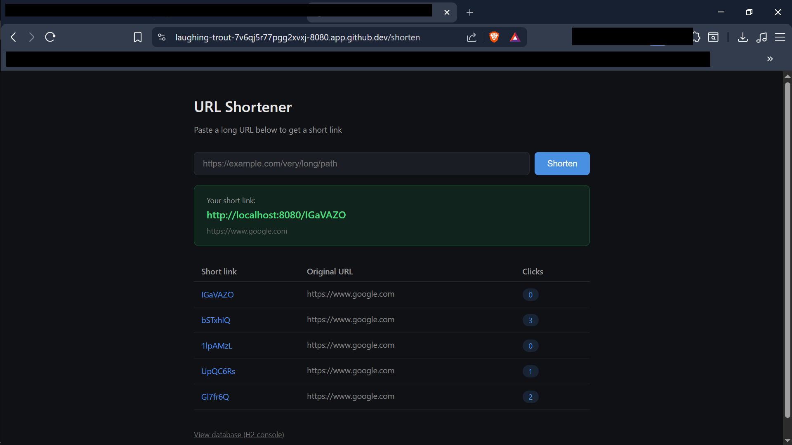

# URL Shortener

**Languages:** [English](README.md) | [日本語](README.jp.md)

---
A URL shortener with a simple web interface, built with Spring Boot + Thymeleaf.
Paste a long URL, get a short link, and track how many times it's been clicked.

## What this is

A small full-stack Java web app — not just an API, but an actual page you can use
in a browser. I built this as a "junior Java developer" level project after
working mostly with frontend/AWS projects before.

## How it works

1. Paste a URL into the form on the homepage
2. The app generates a random 7-character code (e.g. `Gl7fr6Q`) and saves the
   mapping in a database
3. Visiting `/Gl7fr6Q` redirects to the original URL and increments a click counter
4. The homepage shows a history of recent links with their click counts

## Tech used

- Java 17
- Spring Boot 3.2 (Web + Thymeleaf + JPA)
- H2 (in-memory database — no separate database server needed)
- Form validation with Jakarta Validation

## Screenshot



## Running it

```bash
mvn spring-boot:run
```

Then open `http://localhost:8080`.

The database is in-memory (H2), so data resets each time the app restarts.
You can browse the database directly at `http://localhost:8080/h2-console`
(JDBC URL: `jdbc:h2:mem:urlshortener`, user: `sa`, no password).

## A few notes on how it's built

- **Why H2 instead of PostgreSQL?** For a small project like this, an in-memory
  database means zero setup — no Docker, no separate database server. The same
  JPA code would work with PostgreSQL by just changing the connection settings.

- **Why not Redis for caching?** Same reasoning — a `ConcurrentHashMap` inside
  the app does the same job (fast lookups without hitting the database) for a
  single-server app, with no extra infrastructure. The code comments explain
  the tradeoff (a real multi-server deployment would want Redis so all servers
  share one cache).

- **The `@Transactional` fix:** The click-count update uses a JPA `@Modifying`
  query, which requires an active transaction. Initially this caused a
  `TransactionRequiredException` because the transaction boundary needs to be
  on the method that's called from *outside* the class (`resolveUrl`), not on
  a method called internally (`incrementClick`) — Spring's transaction proxy
  only intercepts external calls.

## Author

Krish — [GitHub](https://github.com/krishfemto)
